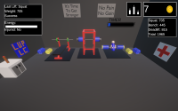
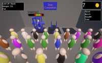

# William Gibson
## Technical Skills: Python, C#, Algorithms, HTML, CSS, Javascript

### Education
B.S. in **Computer Science**, B.A. in **Mathematics**, Minor in **Statistics**\
**University of Virginia** School of Engineering and Applied Sciences\
Relevant coursework includes: Data Structures and Algorithms 1 and 2, Discrete Mathematics and Theory 1, Computer Systems and Organization 1, Software Development Essentials, Multivariable Calculus, Ordinary Differential Equations, Linear Algebra, Probability\
GPA: **4.000/4.000**\
Planned Graduation Year: 2028

### Projects
Lifting Unlimited - [Steam Store Page](https://store.steampowered.com/app/2953600/Lifting_Unlimited/)\
  
-	Designed, developed, and published a weightlifting video game in Unity using C# that achieved approximately **570 downloads**
-	Utilized knowledge of object-oriented programming to create complex inheritance relationships that increased runtime efficiency and decreased code reuse and to understand Unity’s Game Object system
-	Constructed algorithms using knowledge of data structures, such as state machines, arrays, and structs, to program various game functions, including player progression, updating visuals, and storing player data from game to game
-	Implemented game mechanics, such as UI elements, player controls, and weightlifting progression logic
-	Solicited feedback and advice from other game designers and video game players
-	Debugged all game elements to find code issues. Created a professional and appealing store page and gameplay trailer, and published the game on Steam

### Work Experience
TIC Summer Camp, McLean, Virginia, **Program Lead in Computer Science**, June 2024 - August 2025
- Supervised 11 coding counselors at TIC Summer Camp in project planning, professional development, and team-building
-	Applied computer science experience to teach employees how to instruct campers in programming
-	Collaborated with managers of other camp departments in making leadership-level decisions
-	Provided performance feedback to all 11 employees on teaching style and organization
